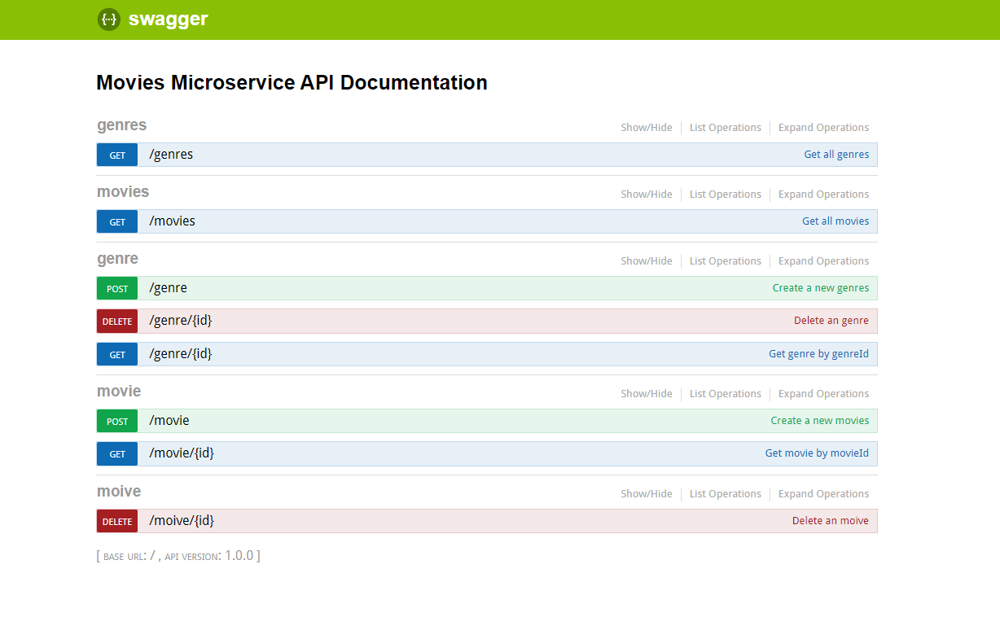

# movie-microservice-node-test

Example Node.js CRUD microservice for an Employee entity with unit tests, mocking, code style checking. The microservice exposes REST APIs which are documented using [Swagger](http://swagger.io/).

## Getting Started

### Requirements:

- [Node.js](https://nodejs.org/en/download/)
- [Docker](https://www.docker.com/community-edition)

### Checkout and run the code

```bash
git clone https://github.com/ahsanjutt01/movie-microservice-node-test.git
cd movie-microservice-node-test
npm install
npm start
```

Once the server is started you can access the following URLs:

- Server: http://localhost:8000/
- [Swagger](https://swagger.io/) API documentation: http://localhost:8000/docs



## Libraries

The following libraries are used in this project:

- **Web Server Framework**: [hapi](https://hapijs.com/) with [swagger](https://github.com/glennjones/hapi-swagger) and [good](https://github.com/hapijs/good) plugins. [Boom](https://github.com/hapijs/boom) for HTTP errors. [Request](https://github.com/request/request) for making HTTP requests
- **Logging**: [winston](https://github.com/winstonjs/winston)
- **Testing**: [mocha](https://mochajs.org/) with [chai](http://chaijs.com/) for [BDD](https://www.agilealliance.org/glossary/bdd) and [sinon](http://sinonjs.org/) for mocking
- **Code Coverage**: [nyc](https://github.com/istanbuljs/nyc)
- **Code Style**: [eslint](http://eslint.org/)
- **Deployment**: [Docker](https://www.docker.com/community-edition)

## Available build scripts

The available scripts are in the `package.json` file:

- `npm start` - start the application
- `npm run dev` - start the application in development mode, e.g. application reloads each time a change is made.
- `npm test` - run the unit tests, the results are printed to the screen
- `npm run test-ci` - run the unit tests, the results saved to a file to use in a Continous Integration tool
- `npm run test-debug` - run the tests enabling debug mode
- `npm run coverage` - run the code coverage
- `npm run debug` - run the app in debug mode
- `npm run lint` - run linting of the application code

## Unit Tests and Coverage

To run the unit tests

```bash
npm test
```

The test results are printed to the screen. To produce the test results in junit format use the `npm run test-ci` script

To generate the code coverage reports:

```bash
npm run coverage
```

The coverage reports are available in HTML format in `employee-microservice-node/coverage/index.html`

## Docker

This microservice can be built as a docker container. See the [`Dockerfile`](./Dockerfile)

To build a docker image:

```bash
docker build -t ahsan/movies-microservice-node-test .
```

To run the docker image:

```bash
docker run -p 8000:8000 ahsan/movies-microservice-node-test
```

Publish the image to [Docker Hub](https://hub.docker.com/), using your Docker Hub login details:

```bash
docker login
docker push ahsan/movies-microservice-node-test
```

## TODO

- Continuous deployment using CircleCI
- Add authentication
- Add JSDocs support
